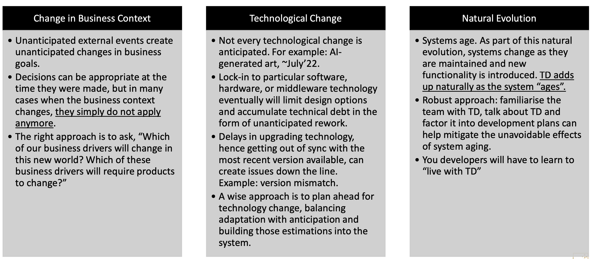

 

# Other Cause of the TD 

## General Cause (beyoung code)

### ~~Intuitions of such TD~~

-   ~~埋冤其他开发者对解决技术债务没有帮助 Talking about who failed is not sufficeint to do anythign about it. Stop blaming your colleagues, because that will not bring a soltuon, you cannot change the past.~~ 
-   ~~正确的方式是尝试理解软件项目的复杂度An important step towars getting ahead of TD is to undersnad teh realities and compelxiities of sofwtare development that ause the debt~~ 
-   ~~While understnading the cause will not providea direct path to the precise lcoatiojn of the actual debt, it will **provide a map of the nvironment nad hle pyou odecide where to statr looking** more carefully.~~

### TD Behavioural Root 

-   Fowler's Four Quadrant TDs (revisited)

     

-   **Unintentioanl TD (inadvertent)**

    -   These cause rnages from incomplete and reckless development behavours, to small inadvertnat action that result from lack of disciple nad plannign, to just not knowing any better. Software developers and manager **do not choose to introduce this technical debt**, they only do this acciently 

    

-   **International TD (Deliverate)**

    -   The caue of intentional debt are **clear to the devleopment team** . This team has busineess goals to satisfy **within the short time frame** . Intentional TD involves careful and deliverate decision making by software developers and managers. 

    -   Or it can also be a reckless "who cares!". In thes casese, it can **become long term debt** 

        (虽然主动选取接受TD,但是没有加以分析)

## Causes of the Technical Debt

(General Cause (beyound code) CTD)

-   The **cause is never the TD itself,** before managing the TD, you **must understand what allows TD to accumulate**. Otherwise it will keep accumulating. QUOTE "*Software developers often confuse the causes that lead to accumulation of TD with the system artifact that has the debt and that should be fixed.*"

-   (Example of TD and TD's cause: The project having very little source code commenting hence poor readability is the TD itself, and the potential cause of such TD could be: time pressue, lack of coding standards, personal coding style, limited documentation culture....  Do not confuse between the two) 

-   Cause of the TD includes 

    -   **Business** 

        ​	time and cost pressue 

        ​	mis-alignment of business goals 

        ​	requirements shortfall 

    -   **Change in Context** 

        ​	change in business context 

        ​	change in technology 

        ​	natureal evolution

    -   **Development Process**

        ​	ineffective documentation

        ​	insufficient testing automation 

        ​	misalignemnt of processes 

    -   **People and team** 

        ​	inexperienced teams 

        ​	distributed teams (different locations and timezones) 

        ​	un-dedicated teams 

### Cause: Business

-   ![2023.05.12 - 14_34_40 -  [Preview-09-Lecture-Week9.pdf] -](assets/2023.05.12%20-%2014_34_40%20-%20%20%5BPreview-09-Lecture-Week9.pdf%5D%20-.jpg)

### Cause: Change in Context 

-   TD is a time-related concept, a **deisgn choice that did not create any TD at the time** the deicosn was made can **trigger re-archietcture when system context changes** (for instance consider where the system only requires tens of dozens of requirement, the developers decides to build the data storing without a database, but only read/writting from file .....)

-   

### Cause: Development Process

-   ![2023.05.12 - 14_36_37 -  [Preview-09-Lecture-Week9.pdf] -](assets/2023.05.12%20-%2014_36_37%20-%20%20%5BPreview-09-Lecture-Week9.pdf%5D%20-.jpg)

### Cause: People and team 

-   One of the cirital and often overlooked influence on system development is the people developing the system 
-   ![2023.05.12 - 14_36_45 -  [Preview-09-Lecture-Week9.pdf] -](assets/2023.05.12%20-%2014_36_45%20-%20%20%5BPreview-09-Lecture-Week9.pdf%5D%20-.jpg)

## ~~Related to SE~~ 

-   ~~Managing TD requires a booad understanding of software engineering practices ....~~ 

    ~~and you must provide your team with those practices~~ 

-   ~~not using sound and proven practice to run a sofwtare engineering project is likely to bring you a lot of TD~~ 

-   ~~If you do not intitutionalize good coding stnads 直觉化标准代码规范 and code qualities checking practices, in time your code ilwl inevitably degrade~~ 

-   ~~Good coding, archiectutre and production pracgies are essential components of good osfwtare engineering and lead to greater responsiveness to budinessns needs and quality code that is easier to evolve and maintain~~

>   ~~Do not get wrong `TD != bad quality` (some times you choose to do introduce it for the good of smoethign else)~~ 
>
>   ~~But can certianlly lead to bad quality. Archietctureal TD has high ownership cost, hence sould be resolves as soon as possible.  ALL SOFTWARE HAS TD JUST LIKE ALL SOFTWARE HAS BUGS~~ 

## Critial Practice to Develop Maintainable Code 

### Sound - Coding Standards

(Establising and following sound coding standarsds)

-   Coding standards are guidelines for specific programming languages that recommend programming style, practices, and method for each aspect of a program writtent in that lanaguge 

-   Different Lanaguegs 

    -   A programming lanaguge may have its own "idols"

        (e.g. python for datascience is coded differently than for web devleopment) 

        **DO NOT CROSS APPLY STANDARDS** 不用语言的代码规范不适配!!!!!!!!!!!!!!!!!

-   Other areas of concern includes file organization and docuemntaiton in the ofrm of comment to improve understandability of the overall codebase 

-   Integrate devleopment enviornemnt (IDE) help enfore standards and styling guides.

### Secure - Coding Standars

(Enstablishing and following secure code stands) 

-   Secure coding is the practice of developing sofwtare in a way that **guards againt the accidental** introduction of logic flaws and implmentation mistake that result in commonly exploited sofwtare vulnarabilities 
-   Security issues in that late stages of a sofawtre will accumilate exponentially amount of TD 未来影响客观
-   All these bulnarbilities in time will cerate security risk that can crash the system, be explotted or both.  

### Maintable Code

(Writting Maintainable Code)

-   Maintainability incporates such oncept such as **changability, modularity, understnadavility testtabilit, and reusability**
-   Too many properties will effect maintainability
-   Writting maintable code is part of developign high quality code
-   In the same way, udnerstanding maintanility is part of the archietucture of the ststem
-   Estabilitshing clea baseline for these practices will help you avoid the kind of technical debt that is most commonlu seen and most costly, yet least likely to be fixed. 

### Refacroting 

-   Refacroting is behavour:

    -   Preserving transformation that improves the overall code quality 
    -   Refacroting is not simply cleaning to code
    -   It is a technique involving applying known patterns of improvement 

-   Unit Testing 

    -   Before refacroging code, you need a solid set of automated unit tests

    -   unit tests **safeguards againt intrducing new issues unintentially** 

        Savvy developers ensure that unit test are used and passed during refacroging activiies 

    -   It does not solve deeply rooted archietcture isssues, but can improve maintainability and code quality.

----

## Other topics 

### Incremental Deisng Requires 

-   **Understanding that short-term and long-tern goals of the business and therefore, the key quality attribute requirements.** Quantitative response measure and priorities for quality attribute reuqiremnes will help team establish design strategies for these requirements. 

-   **Eliciting quality attributes as early as possible in the project** . They should be prioritized based on technical difficulty and value 

-   Understnading the dependencies bteween technical constraints, product used and thes 

    

### PENDING 

[2023.05.12 - 15_01_22 -  [Preview-09-Lecture-Week9.pdf] -](assets/2023.05.12%20-%2015_01_22%20-%20%20%5BPreview-09-Lecture-Week9.pdf%5D%20-.jpg)

[2023.05.12 - 15_01_17 -  [Preview-09-Lecture-Week9.pdf] -](assets/2023.05.12%20-%2015_01_17%20-%20%20%5BPreview-09-Lecture-Week9.pdf%5D%20-.jpg)

[2023.05.12 - 15_01_06 -  [Preview-09-Lecture-Week9.pdf] -](assets/2023.05.12%20-%2015_01_06%20-%20%20%5BPreview-09-Lecture-Week9.pdf%5D%20-.jpg)

